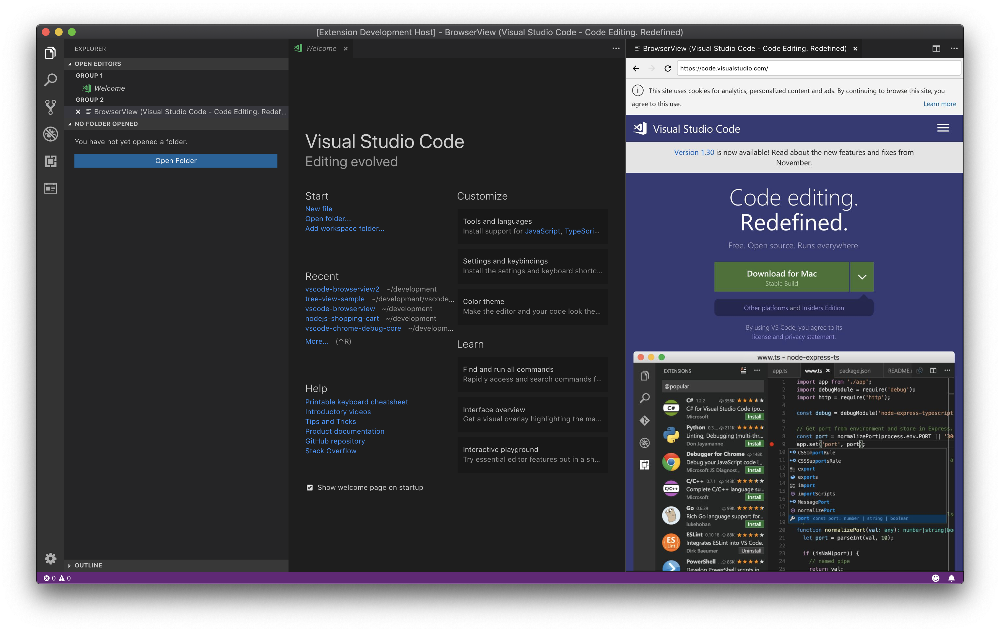

   
  

    
  

  <h1>
    VS Code BrowserView
      
  </h1>
  <h4>Open a real browser view inside VS Code (Powered by Chrome Headless)</h4>

BrowserView for VS Code enables you to open a real browser view inside VS Code. The browser view is powered by Chrome Headless, where BrowserView controls the headless browser instance and streams the rendered content back to VS Code.

This enables a secure way to render web content inside VS Code, and opens the door for many interesting debugging oppertunities, as BrowserView is a real browser, and not just a WebView or iFrame.

